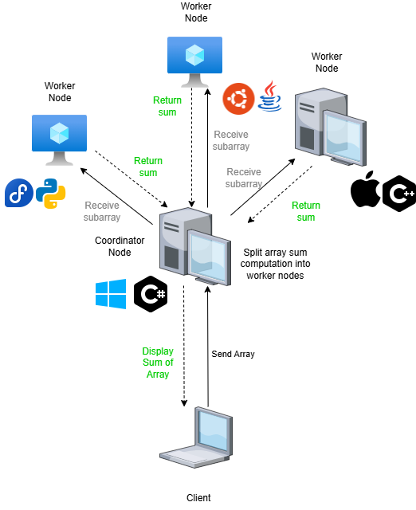

# Distributed Array Sum Design

## Summary

- Distributed array summation system
- Multiple nodes have differente languages and OSs (may be physical or virtual)
- One coordinator nodes (which may be reelected) delegates sub-parts of array summation to the other nodes
- Communication is done through **gRPC**
- Capable of handling node or coordinator failures, with proper recovery.
- All nodes output/display their current status or operations through a console

## Assumptions

- The array of N integers is initially available at the coordinator node OR is sent by a client through an API (extra feature to be developed further along).
- The system will consist of multiple nodes (physical computers or VMs).
- Each node will have a gRPC server running to handle incoming messages.
- Communication between nodes will be done over gRPC.
- Each member must implement using different operating systems and different programming languages (both must support gRPC).
- In case of a coordinator node failure, a leader election process will trigger over gRPC.
- Nodes must recover gracefully from temporary network issues or process crashes.

## Architecture

- Coordinator node:
  - Splits the array into chunks.
  - Calls worker nodes’ gRPC services to send chunks.
  - Collects partial sums via gRPC responses.
  - Computes and displays final sum.
  - Detects failures through gRPC connection errors.
- Worker Nodes:
  - Expose gRPC service endpoints to:
    - Receive array chunks.
    - Compute and return partial sums.
  - Participate in leader election (if needed) through gRPC communication.
    - Chosen election algorithm is the *Bully Algorithm*

## Class diagram

## Behavioral diagrams

### Sequence Diagram of System Normal Operation

### Sequence Diagram of Worker Failure

### Sequence Diagram of Coordinator Failure

### State Diagram of a node

## Test plan

### Unit Tests

### Integration Tests

### End-to-End Tests

### Load Tests

### Recovery Tests
