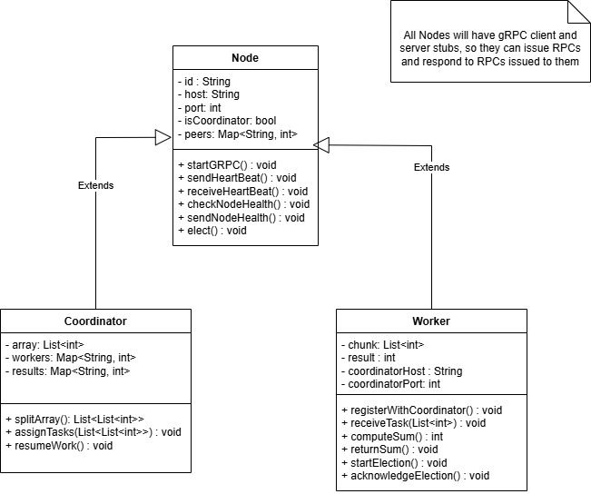
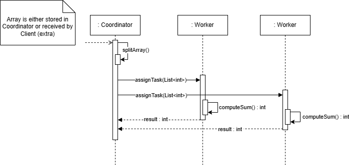
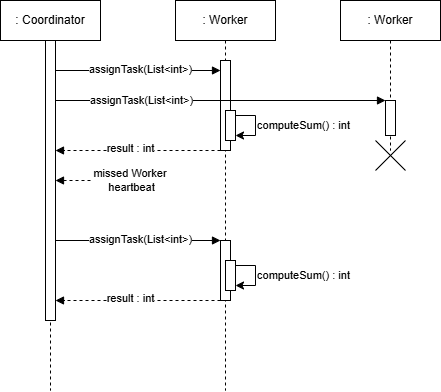

# Distributed Array Sum Design

## Summary

- Distributed array summation system
- Multiple nodes have differente languages and OSs (may be physical or virtual)
- One coordinator nodes (which may be reelected) delegates sub-parts of array summation to the other nodes
- Communication is done through **gRPC**
- Capable of handling node or coordinator failures, with proper recovery.
- All nodes output/display their current status or operations through a console

## Assumptions

- The array of N integers is initially available at the coordinator node OR is sent by a client through an API *(extra feature to be developed further along, may or may not be developed. If it is, this documentation will be updated to reflect choice)*.
- The system will consist of multiple nodes (physical computers or VMs).
- Each node will have a gRPC server running to handle incoming messages, and a client to send them.
- Communication between nodes will be done over gRPC.
- Each member must implement using different operating systems and different programming languages (both must support gRPC).
- In case of a coordinator node failure, a leader election process will trigger over gRPC.
- Nodes must recover gracefully from temporary network issues or process crashes.

## Architecture

- Coordinator node:
  - Splits the array into chunks.
  - Calls worker nodes’ gRPC services to send chunks.
    - Chunk arrays sent as bytes instead of repeated fields for higher performance.
  - Collects partial sums via gRPC responses.
  - Computes and displays final sum.
  - Detects failures through gRPC connection errors.
- Worker Nodes:
  - Expose gRPC service endpoints to:
    - Receive array chunks.
    - Compute and return partial sums.
      - Each worker returns sum to coordinator as a single integer.
  - Participate in leader election (if needed) through gRPC communication.
    - Chosen election algorithm is the *Bully Algorithm*
- Distributed System setup:
  - Worker nodes register themselves at the coordinator
  - Coordinator will distribute tasks based on the number of succesfully registered nodes (if a node fails to register, it is ignored).
  - Both the coordinador and worker nodes regularly check health of each other
    - If a worker node fails the check, the coordinator excludes it from task assignment and optionally redistributes its task
      - If detected to be healthy again, re-added.
    - If the coordinator node fails the check, a leader election is triggered among the workers to elect a new coordinator
      - The new coordinator resumes array sum calculation with its own calculated value and by receiving worker status, after notfying new coordinator.
      - Old coordinator may be re-added as worker when healthy.

## Class diagram

At the very beginning every node is of type `Node`, until the first election is concluded.

Onwards, at any moment, only `Worker` and `Coordinator` nodes exist, even if they "exchange" roles.

## Behavioral diagrams

### Sequence Diagram of Node Setup

### Sequence Diagram of System Normal Operation

### Sequence Diagram of Worker Failure

### Sequence Diagram of Coordinator Failure

### State Diagram of a node

## Test plan

**Disclaimer:** Some of these tests may assume certain nodes to be running on certain endpoints

### Unit Tests

### End-to-End Tests

### Load Tests

### Recovery Tests
