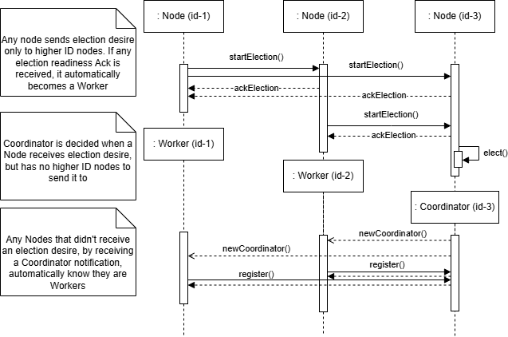
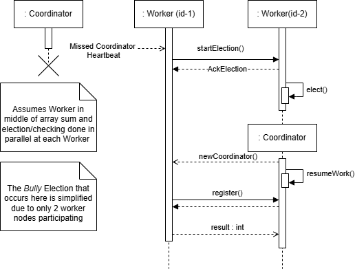

# Distributed Array Sum Design

## Summary

- Distributed array summation system
- Multiple nodes have differente languages and OSs (may be physical or virtual)
- One coordinator nodes (which may be reelected) delegates sub-parts of array summation to the other nodes
- Communication is done through **gRPC**
- Capable of handling node or coordinator failures, with proper recovery.
- All nodes output/display their current status or operations through a console

## Assumptions

- The array of N integers is initially available at the coordinator node OR is sent by a client through an API *(extra feature to be developed further along, may or may not be developed. If it is, this documentation will be updated to reflect choice)*.
- The system will consist of multiple nodes (physical computers or VMs).
- Each node will have a gRPC server running to handle incoming messages, and a client to send them.
- Communication between nodes will be done over gRPC.
- Each member must implement using different operating systems and different programming languages (both must support gRPC).
- In case of a coordinator node failure, a leader election process will trigger over gRPC.
- Nodes must recover gracefully from temporary network issues or process crashes.

## Architecture

- Coordinator node:
  - Splits the array into chunks.
  - Calls worker nodes’ gRPC services to send chunks.
    - Chunk arrays sent as bytes instead of repeated fields for higher performance.
  - Collects partial sums via gRPC responses.
  - Computes and displays final sum.
  - Detects failures through gRPC connection errors.
- Worker Nodes:
  - Expose gRPC service endpoints to:
    - Receive array chunks.
    - Compute and return partial sums.
      - Each worker returns sum to coordinator as a single integer.
  - Participate in leader election (if needed) through gRPC communication.
    - Chosen election algorithm is the *Bully Algorithm*
- Distributed System setup:
  - Worker nodes register themselves at the coordinator
  - Coordinator will distribute tasks based on the number of succesfully registered nodes (if a node fails to register, it is ignored).
  - Both the coordinador and worker nodes regularly check health of each other
    - If a worker node fails the check, the coordinator excludes it from task assignment and optionally redistributes its task
      - If detected to be healthy again, re-added.
    - If the coordinator node fails the check, a leader election is triggered among the workers to elect a new coordinator
      - The new coordinator resumes array sum calculation with its own calculated value and by receiving workers status, after notfying them of its promotion.
      - Old coordinator may be re-added as worker when healthy or start election and become coordinator again.

## Class diagram

At the very beginning every node is of type `Node`, until the first election is concluded.

Onwards, at any moment, only `Worker` and `Coordinator` nodes exist, even if they "exchange" roles.

**Note:** `HeartBeat` is sent periodically, whilst `NodeHealth` is checked or issued upon request.

## Behavioral diagrams

### Sequence Diagram of Node Setup

### Sequence Diagram of System Normal Operation

### Sequence Diagram of Worker Failure

### Sequence Diagram of Coordinator Failure

No need for additional step of notfying coordinator is down, since once a node detects or starts an election, any computed subarray sum is only sent after new coordinator is decided.

## Test plan

**Disclaimer:** Some of these tests may assume certain nodes to be running on certain endpoints.

**Outcomes:** Varied implementation of tests and resulting outcomes can be done, therefore outcomes haven't been neatly specified, only test intention.

### Unit Tests

Test individual node level functionality without networking.

|Test|Description
|-------|-----------------|
|Split Array|Check correct splitting of array according to reigstered nodes|
|ComputeSum|Check correct partial sum computation|
|HeartBeatSending|Verify heartbeat signal and frequency|
|HealthCheckSending|Verify correct Health Check info|
|ChunkAssignment|Test correctly chunk delivery|
|Result Aggregation and Display|Test Correct Final Sum Result based on partial sums received|

### End-to-End Tests

Run real nodes connected via gRPC, and test valid interaction between nodes.

|Test|Description|
|-------|--------|
|Initial Election|System startup with no pre-assinged Coordinator|
|Worker registration|Check worker nodes correctly register themselves and the Coordinator has a correct registration list|
|Full Sum|Perform the normal system operation and check results |
|Multiple (3+) Nodes|Use 3 or more nodes in system|
|Start Node Mid-Program|Start a new node mid active program (should trigger Election)|

### Load Tests

Evaluate performance with larger data and more nodes.

|Test|Description|
|-------|--------|
|Large Array|Test System functionality and correct result when working with a large array|
|Many Nodes (via containers)|Run system with 10+ workers (using containers)|

### Recovery Tests

Simulate node and network failures, and tests according resilience.

|Test|Description|
|-------|--------|
|Worker Crash|Check what happens when a worker is killed mid-task, Coordinator should correctly reassign task|
|Coordinator Crash|Check what happens when a Coordinator is killed mid-task, election should be triggered and computation resumed and sent to new Coordinator|
|Worker Network Loss|Same as Crash, but with connectivity loss|
|Coordinator Network Loss|Same as Crash, but with connectivity loss|
